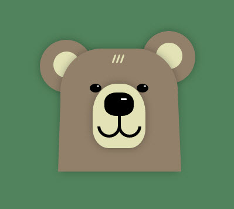

# Daily CSS Challenge
## Day 1 - Bear Cub
### Inspiration
1. [Cute hand drawn bear design | freepik](http://www.freepik.com/free-vector/cute-hand-drawn-bear-design_854159.htm)
2. [Hand drawn lovely bear with a striped t-shirt | freepik](http://www.freepik.com/free-vector/hand-drawn-lovely-bear-with-a-striped-t-shirt_866237.htm)
3. [Collection of nine animals in flat design | freepik](http://www.freepik.com/free-vector/collection-of-nine-animals-in-flat-design_1050573.htm)
4. [Triangle bear design | freepik](http://www.freepik.com/free-vector/triangle-bear-design_723865.htm)
5. [Cute polar bear art print, by AGrapeDesign | Pinterest](https://www.pinterest.com/pin/308848486926410344/)
6. [POLAR BEAR, by Miss Malagata | Pinterest](https://www.pinterest.com/pin/330099847665043236/)

### Note

1st challenge of Daily CSS Images! Also my 1st time implemented project with SCSS. :P

##### Tools

- [Clippy](http://bennettfeely.com/clippy/)
	- A CSS clip-path maker. Users can easily drag the points to generate the shape they want. 

##### Keywords 
- [Vendor prefixes](https://developer.mozilla.org/en-US/docs/Glossary/Vendor_Prefix)
	- `-webkit-`: Chrome, Safari, *newer* versions of Opera
 	- `-moz-`: Firefox
 	- `-o-`: *Old* versions of Opera
	- `-ms-`: Internet Explorer
- `clip-path: <shapes>`
	- To draw a shape of mask. (PS. There used to be a `clip` property, but note that is [deprecated](https://www.w3.org/TR/css-masking-1/#clip-property).)
	- [Possible shapes | MDN](https://developer.mozilla.org/en-US/docs/Web/CSS/basic-shape)
		- `polygon()`
			- To draw a shape with serveral points, like rect, prallelograms etc. 
		- `circle()`
			- `circle(50% at <center_point>)`
			- To draw a simple shape - circles.
		- `ellipse()`
- `transform: rotate()`	
- Pseudo Elements
	- `::before`
	- `::after`
- `box-shadow`
- `calc()`
	- calculate for any length. Very useful for calculating length between percentage and pixels.

### Final Work
- [01 :: Bear Cub | CodePen.io](http://codepen.io/cctina/full/qRwLjp/)

