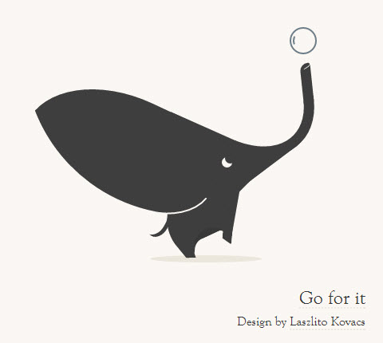
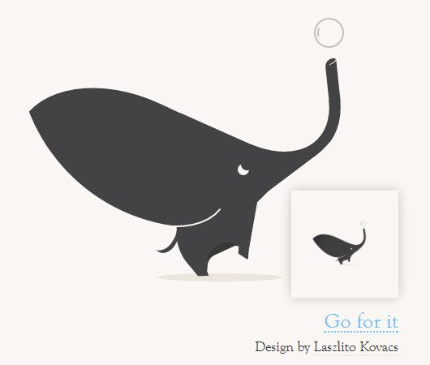

# Daily CSS Challenge
## Day 2 - Elephant
### Inspiration

##### Elephant
1. [testing, by Lydia Nichols | dribbble](https://dribbble.com/shots/1152703-testing)
2. [Go fot it, by Laszlito Kovacs | dribbble](https://dribbble.com/shots/1192090-Go-for-it)
3. [Elephant Concept, by Vic 🍕 | dribbble](https://dribbble.com/shots/1282005-Elephant-Concept)

##### Style
1. [ha!, by Lydia Nichols | dribbble](https://dribbble.com/shots/1440147-ha)
2. [heh!, by Lydia Nichols | dribbble](https://dribbble.com/shots/1300177-heh) 

### Note
The reference image has so many different curves... It's time-consuming (it took me 3 days!) and hard to draw this kind of images perfectly without svg. I'll try not to choose images like this after, or start to draw an svg next time. 

##### Keywords
- `clip-path`
	- circle()
	- polygon()
- `transform: rotate()`
- CSS: Shapes with border
	- Use **border** to draw shapes. 
		- [Working with Shapes in Web Design - Shapes with border | CSS Tricks](https://css-tricks.com/working-with-shapes-in-web-design/#shapes-border)
	- E.g. triangles with a 90 deg at left-bottom corner
	
			.triangle {
				width: 0;
				height: 0; 
				border-bottom: 50px solid $primary-color;
				border-right: 80px solid transparent;
			}
- Image Tooltip (customized tooltip)
	- `:hover ::after {...}`
		- Create a pseudo element on event 'hover'. (Using whichever `::before` or `::after` is fine.)
	- Set an image as a background image. 
		- `background: url(...) no-repeat center center local`: Set background image.
		- `background-size: cover`: Scales the image as large as possible and maintains image aspect ratio (image doesn't get squished). The image "covers" the entire width or height of the container. (source: [background-size | MDN](https://developer.mozilla.org/en-US/docs/Web/CSS/background-size))
- SASS
	- `@mixin`

### Final Work
- [02 :: Elephant | CodePen.io](http://codepen.io/cctina/full/xgvdXp/)

### Credit
- Original Design
	- Source: ["Go for it"](https://dribbble.com/shots/1192090-Go-for-it) on Dribbble	
	- Author: [Laszlito Kovacs](https://dribbble.com/laszlito_k)