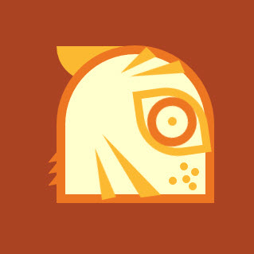
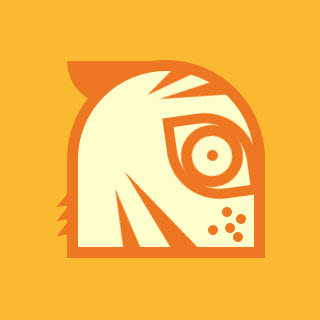

# Daily CSS Challenge
## Day 4 - Tiger
### Inspiration

#### Tiger
1. Article: [Cambodia Launches Plan To Reintroduce 'Functionally Extinct' Tigers | npr](http://www.npr.org/sections/thetwo-way/2016/04/07/473409894/cambodia-launches-plan-to-reintroduce-functionally-extinct-tigers)
2. [Strength Shaman, by Owen Davey | Dribbble](https://dribbble.com/shots/2924248-Strength-Shaman)
3. [Tiger Mask, by Aaron Eiland | Dribbble](https://dribbble.com/shots/830338-Tiger-Mask)
4. [Tiger, by Richard Perez | Dribbble](https://dribbble.com/shots/1369454-Tiger). And I use its color set from here!
5. [Tiger, by Anna Hurley | Dribbble](https://dribbble.com/shots/1707808-Tiger)

#### Style
1. [Leo, by Paul Saksin | Dribbble](https://dribbble.com/shots/791617-Leo)
2. [Mystery Project 66.3, by DKNG | Dribbble](https://dribbble.com/shots/1965906-Mystery-Project-66-3)

### Note
I decided to make my design simple this time, only some strokes. But it wasn't that simple to design a Minimalism graphic. In the end, I still spent a lot of time in total of design + coding. :P I really appreciate people who has an art talent now.

About my codes, I used some SASS `@mixin` to geanerate some similar CSS classes. That's useful, and it made my code more clear! 

I also tried to add some animations on the eye. Since the eye was not symmetric with repect to either x-axis or y-axis, I had to combine some transform functions to make it work (`rotate`, `scale`, and `skew`). And then it will work great!

##### Keywords
- SASS
	- `#{$var}` Use a variable to create a dynamic string.
		- e.g. Use it to create CSS classes in a mixin. 

				@mixin fur($number, $posTop, $posRight) {
					.fur-#{$number} {
						@extend .fur;
						@include position-corner-top-right(absolute, $posTop, $posRight);
					}
				}
		- Result: creates classes `.fur-1`, `.fur-2`, etc.

- Values of property `box-sizing`:
	- `content-box`
		- Default value. The height & width only include the **content**, but not the padding, border, or margin. 3 of them will be outside of the box.
	- `border-box`
		- The height & width include **content**, **padding** and **border**. 
		- Only margin will be outside of the box.
		- More convienient!
- Values of property `transfrom`
	- `skew()`, or `skewX()`, `skewY()`
		- Skew the shape. Make the element like a parallelgram. Input *degrees* for the funcion. 
		- e.g. `skew(30deg, 20deg);`
		- `skewX()`: shift top & bottom border along x-axis.
		- `skewY()`: shift left & right border along y-axis.
	- `scale()`
		- Make elements getting larger or smaller. Input mutiplied number for the function. 
		- e.g. `scale(1.3)` => That means the element would be in a 1.3 mutiplied size.
- Animation
	- `@Keyframes`
		- Create an animation process by `@keyframes`.
			- Set the values of properies would like to be changed by *percentages* or *from...to*.
		- How to use the keyframes?
			- Set property `animation` inside the targeting CSS classes. 
			- Also [other properties](https://developer.mozilla.org/en-US/docs/Web/CSS/animation) if needed. (`animation` is a shorthand property)
				- `animation-name`
				- `animation-duration`
				- `animation-iteration-count`
				- `animation-direction`
				- ...
	- Eye blink
		- Animation reference: [Day 5 - CSS Dory - #dailycssimages](https://codepen.io/RachelSeale/pen/KaORQE), by Rachel Seale | CodePen.io
		- Because of the shape of eye, it is needed to set 3 values --- `rotate()`, `scale()`, `skew()` from `transform` property in the same time to make the blink works. 

### Final Work
- [04 :: Tiger | CodePen.io](http://codepen.io/cctina/details/PpoYvg/)

- Color Theme 1
	
	Current color theme.

	

- Color Theme 2 
	
	Uncomment out line 18 ~ 20 in `tiger.scss`, and re-complie it. 

	