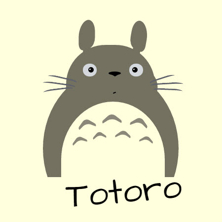

# Daily CSS Challenge
## Day 5 - Favorite Animated Animal
### Inspiration

##### Totoro
1. [MY NEIGHBOR TOTORO ILLUSTRATION, by Lauryn Walker | Ryn Lyra - Photographic & Design](http://rynlyraphotography.com/my-neighbor-totoro-illustration/)
2. [My Neighbour Totoro - Umbrella Totoro, by RaptorCore7 | Pinterest](https://www.pinterest.com/ToeSoxMama/totoro/)
3. [Totoro Film Poster, by betty fishcake | Bēhance](https://www.behance.net/gallery/5698489/Totoro-Film-Poster)
4. Article: [【都市伝説じゃない】　必見！　となりのトトロの元ネタ　まとめ | NAVER まとめ](https://matome.naver.jp/odai/2143054614823767101)

##### Other Animated Animals
1. Woodstock (From Peanuts)
2. Winnie the Pooh (From Winnie-the-Pooh)

### Note
Totoro, a character of  movie "[My neighbor Totoro](http://www.imdb.com/title/tt0096283/)" which was produced by [Studio Ghibli](http://www.ghibli.jp/). It is one of my favorite animated animals. :)

Since I made these all works slowly, I skipped the challenge for a short rest yesterday, and tried to adjust my development process. Now I am one day behind, I'll try to catch them all up soon!

##### Keywords
Not much new for this one. :P There you are:

- SASS
	- Try to use some basic conditional statements in the `@mixin`, like `@if`, `@else`.
- `unset`
	- Use `unset` as default value for **position directions**, like top / bottom / left / right. And that was great for integrate all the position mixins (see SCSS file of last work [Day-04](http://codepen.io/cctina/pen/PpoYvg)) into one.

### Final Work
- [05 :: Favorite Animated Animal | CodePen.io](http://codepen.io/cctina/pen/JWowxg)

