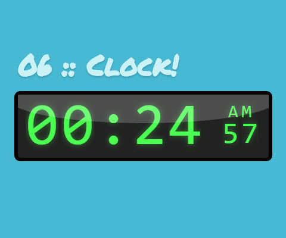

# Daily CSS Challenge
## Day 6 - Clock
### Inspiration

##### Clock
1. [Digital Clock Clip Art | ClipartFest](https://clipartfest.com/download/321e1f92a80fd3a7605501439e771e4c992cd83a.html)
2. [數字鐘SHG2 免費, design by Y2PROM  | Google Play](https://play.google.com/store/apps/details?id=com.bakedspiderfree)

### Note
I wanted to make a different style of clock, and the sample pen of an article about "CSS sprite" reminded me to try it on digits animation. It was the time to try this technic. And it seemed good. :) 

And I also used some tricks to getting higher performance for my animation. Such as using `transform: translate(npx,npx)` instead of set position directions -- left/right or somthing directly.

So finally this is it! This digit clock can really work. It just... can't match the real word time without JavaScript. :P (And the AM/PM would switch too! But you have to wait it for 12 hours...)

##### Keywords
- Animation Tricks
	- Animation performance
		- [High Performance Animations | HTML5 ROCKS](https://www.html5rocks.com/en/tutorials/speed/high-performance-animations/)
			- 4 things a browser can animate cheaply:
				1. Position: 	transform: **translate**(npx, npx);
				2. Scale: 		transform: **scale**(n);
				3. Rotation: 	trnasform: **rotate**(ndeg);
				4. Opacity: 	**opacity**: 0...1;
	- CSS Sprite + `Steps()`
		- Inspired by an article from [treehouse blog](http://blog.teamtreehouse.com)
			- article: "[CSS Sprite Sheet Animations with Steps()](http://blog.teamtreehouse.com/css-sprite-sheet-animations-steps)"
			- pen work: [CSS Animation with steps()](http://codepen.io/Guilh/pen/yldGp)
		- CSS Sprite
			- Combine several images into one, and shift it to reveal partial to show the image you want.
			- Pro: Less requests to server & use less resources to get better performance. 
		- `Steps()` (for `transform` property)
			- Split animation keyframes into serveral steps. And animate it as serveral pieces (=steps), not animate it linearly.

### Final Work
- [06 :: Clock | CodePen.io](http://codepen.io/cctina/pen/XMbLNd)

